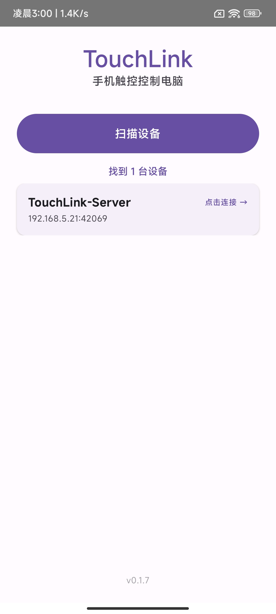
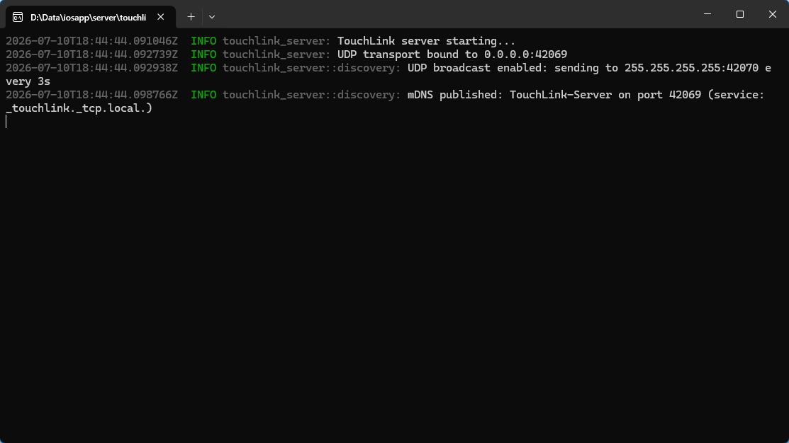

# TouchLink

将 Android 手机变为 Windows 电脑的无线触控板 / 键盘。

手机和电脑在同一个 WiFi 网络下即可使用，无需数据线。

## ✨ 功能

- **触控板模式**：单指移动光标，轻触点击，双指滚动
- **Mac 风格指针加速**：慢速精准定位，快速滑动覆盖大范围
- **即开即用**：手机扫描发现电脑，点击连接
- **双通道发现**：NSD (mDNS) + UDP 广播，适应不同网络环境

## 📱 界面预览

| 手机端 | 电脑端 |
|--------|--------|
|  |  |

## 🚀 快速开始

### 电脑端

从 [Releases](https://github.com/duankong/touch-link/releases) 下载最新版 `touchlink-server-vX.X.X.exe`，双击运行：

```
UDP transport bound to 0.0.0.0:42069
mDNS published: _touchlink._tcp
UDP broadcast started on 42070
```

### 手机端

1. 从 [Releases](https://github.com/duankong/touch-link/releases) 下载 `TouchLink-vX.X.X.apk`
2. 在手机上安装 APK
3. 确保手机和电脑连接同一个 WiFi
4. 打开 TouchLink → 点击「扫描设备」→ 点击电脑名称连接

### 手势

| 手势 | 效果 |
|------|------|
| 单指滑动 | 移动光标 |
| 单指轻触 | 左键点击 |
| 双指滑动 | 页面滚动 |

## 🛠️ 从源码构建

### 环境要求

- **Rust**: 1.75+
- **JDK**: 17 (Eclipse Temurin)
- **Android SDK**: 34
- **Gradle**: 8.9 (wrapper 已包含)

### 构建服务端

```bash
cd server/touchlink-server
cargo build --release
./target/release/touchlink-server.exe
```

### 构建 Android APK

```bash
cd android/TouchLink
./gradlew assembleDebug
# APK 输出: app/build/outputs/apk/debug/app-debug.apk
```

## 📦 版本管理

版本格式 `0.1.X`，其中 X 在每次构建时自动递增。
版本号存储在 `android/TouchLink/version.properties`。

## 📄 协议

MIT License
